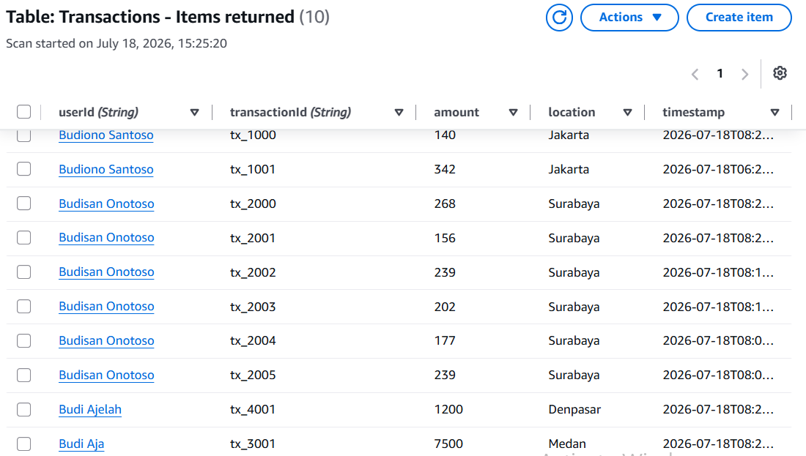
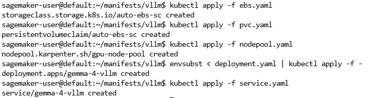
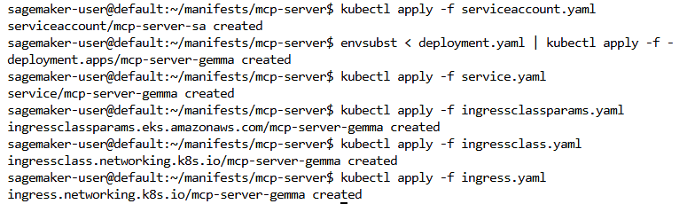
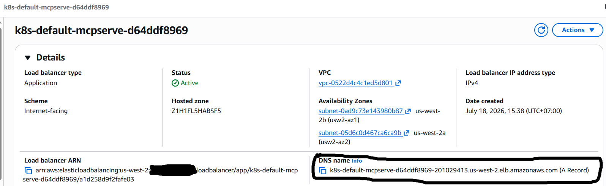
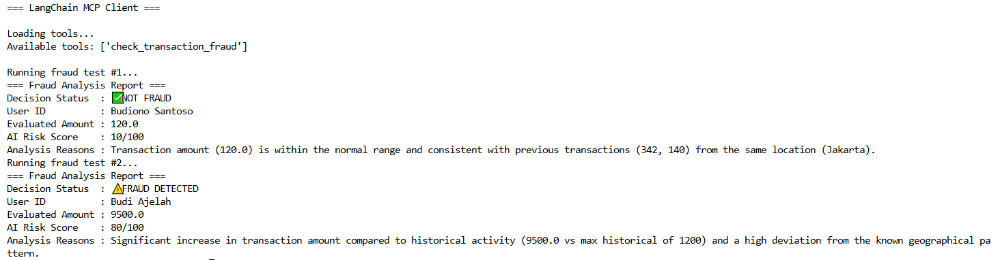

## MCP Server Part 1 : SageMaker Studio, vLLM, Gemma 4 and Terraform for Fraud Detection

1. Make sure already followed the instructions at [this link](https://dev.to/budionosan/mcp-server-part-1-sagemaker-studio-vllm-gemma-4-and-terraform-for-fraud-detection-3k3e) from step 1 until step 6 about installing Terraform and kubectl.

2. Clone this repository in the JupyterLab instance terminal and all files are now available.
```
git clone https://github.com/budionosanai/google-gemma-eks-vllm-dynamodb-fastmcp-fraud-detection.git
cd google-gemma-eks-vllm-dynamodb-fastmcp-fraud-detection
```

3. Run this shell script in the **scripts** folder to pull and push the vLLM image to ECR private repository.
```
cd scripts
chmod +x vllm-to-ecr.sh
./vllm-to-ecr.sh
```

4. Run this script in the **mcp-server** folder to build and push the MCP server image to the ECR private repository.
```
cd ..

cd mcp-server

aws ecr create-repository \
    --repository-name "mcp-server-gemma-4" \
    --image-scanning-configuration scanOnPush=false \
    --image-tag-mutability MUTABLE \
    --region "us-west-2" 2>/dev/null || echo "Repository already exists, skipping creation."

pip install sagemaker-studio-image-build

sm-docker build . --repository mcp-server-gemma-4:latest
```

5. Run this Terraform command in the **terraform** folder to create EKS cluster, DynamoDB table and VPC networking.
```
cd ..

cd terraform

terraform init

terraform plan

terraform apply --auto-approve
```

6. Run this script in the **scripts** folder to generate data and upload it to the "Transactions" DynamoDB table.
```
cd ..

cd scripts

python generate-data.py
```



## MCP Server Part 2 : SageMaker Studio, Kubernetes manifest, Load Balancer and MCP Client for Fraud Detection

1. Run this script in the **manifests** folder to update the EKS Auto Mode cluster.
```
cd ..

cd manifests

export AWS_ACCOUNT_ID=$(aws sts get-caller-identity \
  --query Account \
  --output text)

aws eks update-kubeconfig --region us-west-2 --name vllm-mcp-server

export ROLE_NAME=$(aws iam list-roles \
  --query "Roles[?contains(RoleName, 'SageMaker-ExecutionRole')].RoleName" \
  --output text)

aws eks create-access-entry \
  --cluster-name vllm-mcp-server \
  --principal-arn arn:aws:iam::${AWS_ACCOUNT_ID}:role/service-role/${ROLE_NAME} \
  --type STANDARD \
  --region us-west-2

aws eks associate-access-policy \
  --cluster-name vllm-mcp-server \
  --principal-arn arn:aws:iam::${AWS_ACCOUNT_ID}:role/service-role/${ROLE_NAME} \
  --policy-arn arn:aws:eks::aws:cluster-access-policy/AmazonEKSClusterAdminPolicy \
  --access-scope type=cluster \
  --region us-west-2
```

2. Apply this Kubernetes manifest in the **manifests/vllm** folder to deploy the vLLM service.
```
cd vllm
kubectl apply -f ebs.yaml
kubectl apply -f pvc.yaml
kubectl apply -f nodepool.yaml
envsubst < deployment.yaml | kubectl apply -f -
kubectl apply -f service.yaml
```



3. Run this script in the **manifests/mcp-server** folder to create and configure EKS Pod Identity for access to Amazon DynamoDB.
```
cd ..

cd mcp-server

cat > dynamodb-mcp-policy.json << EOF
{
  "Version": "2012-10-17",
  "Statement": [
    {
      "Effect": "Allow",
      "Action": [
        "dynamodb:*"
      ],
      "Resource": "*"
    }
  ]
}
EOF

aws iam create-policy \
    --policy-name DynamoDBMCPPolicy \
    --policy-document file://dynamodb-mcp-policy.json
rm -f dynamodb-mcp-policy.json

cat > trust-policy.json << EOF
{
  "Version": "2012-10-17",
  "Statement": [
    {
      "Effect": "Allow",
      "Principal": {
        "Service": "pods.eks.amazonaws.com"
      },
      "Action": [
        "sts:AssumeRole",
        "sts:TagSession"
      ]
    }
  ]
}
EOF

aws iam create-role \
    --role-name MCPServerPodRole \
    --assume-role-policy-document file://trust-policy.json
rm -f trust-policy.json

aws iam attach-role-policy \
    --role-name MCPServerPodRole \
    --policy-arn arn:aws:iam::${AWS_ACCOUNT_ID}:policy/DynamoDBMCPPolicy

aws eks create-pod-identity-association \
    --cluster-name vllm-mcp-server \
    --namespace default \
    --service-account mcp-server-sa \
    --role-arn arn:aws:iam::${AWS_ACCOUNT_ID}:role/MCPServerPodRole
```

4. Apply this Kubernetes manifest in the **manifests/mcp-server** folder to deploy the MCP server ingress/load balancer.
```
kubectl apply -f serviceaccount.yaml
envsubst < deployment.yaml | kubectl apply -f -
kubectl apply -f service.yaml
kubectl apply -f ingressclassparams.yaml
kubectl apply -f ingressclass.yaml
kubectl apply -f ingress.yaml
```



4A. [OPTIONAL] Navigate to Amazon EC2 -> Load Balancing -> Load Balancers to make sure ingress/load balancer is now available and wait until load balancer status change to Active.



5. To access the MCP server, you need an MCP client such as the native MCP client from FastMCP or the MCP client from Langchain. Run this script in the **mcp-client** folder to run the fraud detection MCP client.
```
cd ..

cd ..

cd mcp-client

pip install langchain-mcp-adapters

ALB_URL=$(kubectl get ingress mcp-server-gemma -o jsonpath='{.status.loadBalancer.ingress[0].hostname}') python mcp-with-langchain.py

ALB_URL=$(kubectl get ingress mcp-server-gemma -o jsonpath='{.status.loadBalancer.ingress[0].hostname}') python mcp-without-langchain.py
```



6. Run this Terraform command in the **terraform** folder to delete all AWS services such as EKS, VPC, DynamoDB and other services.
```
cd ..

cd terraform

terraform destroy --auto-approve
```

7. Run this script to delete the vLLM image and fraud detection MCP server image in the ECR private repositories.
```
aws ecr delete-repository --repository-name mcp-server-gemma-4 --force --region us-west-2

aws ecr delete-repository --repository-name vllm-gemma-4-eks --force --region us-west-2
```

8. Run this script to delete the IAM role and IAM policy.
```
export POLICY_ARN=$(aws iam list-policies \
    --scope Local \
    --query 'Policies[?PolicyName==`DynamoDBMCPPolicy`].Arn' \
    --output text)

aws iam detach-role-policy --role-name MCPServerPodRole --policy-arn "$POLICY_ARN"

aws iam delete-policy --policy-arn "$POLICY_ARN"

aws iam delete-role --role-name MCPServerPodRole
```

9. In SageMaker Studio JupyterLab, click **Stop space** and [delete your SageMaker Studio domain.](https://docs.aws.amazon.com/sagemaker/latest/dg/gs-studio-delete-domain.html#gs-studio-delete-domain-studio)