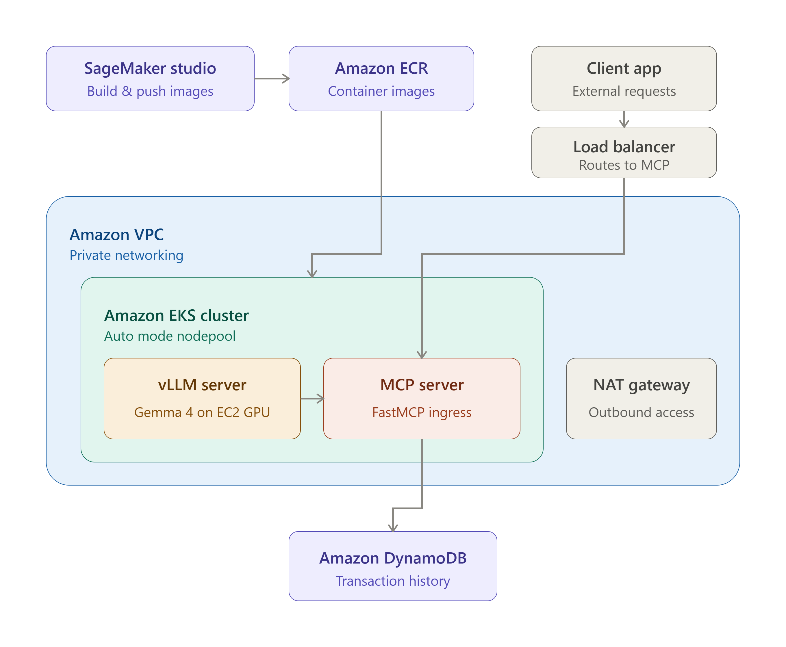

## 📋 Overview

Before using fraud detection, there were several problems such as repeated manual checks, human error, and high operational costs.
This repository explain end-to-end fraud detection case that can analyze new transaction with AI and check transaction fraud from historical DynamoDB data using the Gemma 4 E4B-it model.

## 🏗️ Architecture



## 🛠️ Tech Stack

| AWS Service | Description |
| :--- | :--- |
| Amazon SageMaker AI | Create SageMaker Studio as online IDE. |
| Amazon Elastic Container Registry (ECR) | Create private image such as vLLM inference server image and fraud detection MCP server image. |
| Amazon Elastic Kubernetes Services (EKS) | Create vLLM inference as Kubernetes service and fraud detection MCP as ingress/load balancer. |
| vLLM on AWS Deep Learning Containers (DLC) | Open-source inference and serving engine for Large Language Models such as Gemma 4. |
| Amazon Virtual Private Cloud (VPC) | AWS networking service such as VPC, subnet, security group, NAT gateway etc. |
| Application Load Balancer (ALB) | Load balancer serving MCP server. |
| Amazon DynamoDB | Fraud detection historical data. |
| Amazon Elastic Compute Cloud (EC2) | GPU nodepool for Gemma 4 model vLLM server. |
| Amazon Elastic Block Store (EBS) | Store Gemma 4 model to Persistent Volume Claim (PVC). |
| AWS Identity and Access Management (IAM) | Access to AWS services with least privilege. |

| Name | Description |
| :--- | :--- |
| Terraform | Infrastructure-as-Code (IaC) tool that automatically creating cloud resources. |
| Gemma 4 | Open-source Large Language Models from Google. |
| FastMCP | Framework for building MCP server and MCP client with Python. |
| kubectl | Command line tool for communicating with Kubernetes cluster. |
| Langchain MCP adapter (optional) | Building MCP client with with Python. |

## 📁 Repository Structure

```bash
.
├── images/		# Folder of important screenshot in the INSTRUCTION.md
├── manifests/		# Folder of Kubernetes manifest for MCP server and vLLM server.
│   ├── mcp-server	# Folder of Kubernetes manifest for MCP server such as service account, deployment, service and ingress.
│   ├── vllm		# Folder of Kubernetes manifest for vLLM server such as EBS PVC, EC2 GPU nodepool, deployment and service.
├── mcp-client/		# Folder of connect MCP server using FastMCP client and Langchain MCP client.
├── mcp-server/		# Folder of build and push fraud detection MCP server to Amazon ECR.
├── scripts/		# Folder of Python file and shell script.
│   ├── generate-data.py   # File of generate data and upload data to DynamoDB "Transactions" table.
│   ├── vllm-to-ecr.sh	# File of push vLLM image to Amazon ECR.
├── terraform/		# Folder of Infrastructure-as-Code for AWS services such as Amazon EKS, Amazon VPC and Amazon DynamoDB.
│   ├── dynamodb.tf	# File of create DynamoDB table.
│   ├── eks.tf		# File of create EKS Auto Mode cluster, IAM role for EKS node and IAM role for EKS cluster.
│   ├── main.tf		# File of Terraform AWS version, AWS region and Terraform VPC module.
│   ├── vpc.tf		# File of create EKS networking using Terraform VPC module that make simple configuration.
```

## 📖 Instruction

You can see the instruction in [this file.](./INSTRUCTION.md)

## 💰 Cost

| AWS Service | Description |
| :--- | :--- |
| Amazon SageMaker AI | SageMaker Studio JupyterLab - ml.t3.medium - $0.05 per hour and $0.112 per GB. |
| Amazon ECR | $0.10 per GB per month. |
| Amazon EKS | Cluster - Standard - $0.10 per cluster per hour. |
| Amazon EKS | Auto Mode feature - g6.2xlarge - $0.07625 per hour. |
| Amazon EC2 | GPU - Linux - on-demand - g6.2xlarge - $0.9776 per hour. |
| Amazon EBS | Storage (GP3) - $0.08 per GB per month. |
| Application Load Balancer (ALB) | $0.0225 per hour and $0.008 per LCU-hour. |
| Amazon VPC | NAT Gateway - $0.045 per hour and $0.045 per GB. |
| Amazon VPC | IPv4 address - $0.005 per hour. |
| Amazon DynamoDB | Write - $0.625 per million WRUs, Read - $0.125 per million RRUs and Storage - $0.25 per GB per month. |

## 💰 Cost Optimization Recommendation

| AWS Service | Description |
| :--- | :--- |
| Amazon EC2 | Use saving plan up to 72 %. |
| Amazon DynamoDB | Use reserve capacity up to 77 %. |
| Amazon EKS | Switch to EKS Standard without pay additional Auto Mode feature. | 
| Amazon VPC | Switch from NAT Gateway to VPC Endpoint. |

## ✍️ Tutorial Blog

- https://dev.to/budionosan/mcp-server-part-1-sagemaker-studio-vllm-gemma-4-and-terraform-for-fraud-detection-3k3e
- https://dev.to/budionosan/mcp-server-part-2-sagemaker-studio-kubernetes-manifest-load-balancer-and-mcp-client-for-fraud-22eh

## 🙏 Acknowledgments

**Amazon Web Services (AWS), Google Gemma, vLLM, Terraform, FastMCP and Langchain**